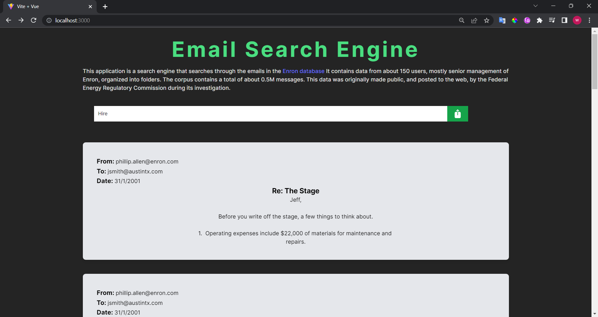
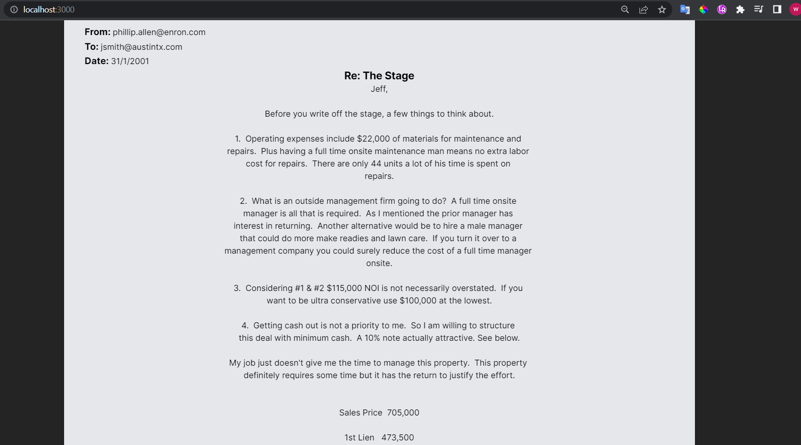
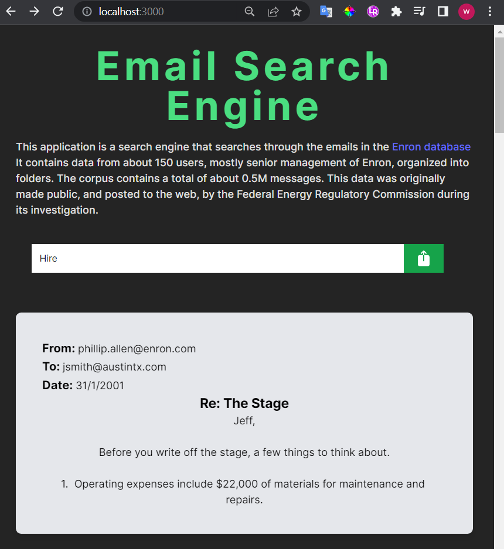

# Enron Mail App

This application is a search engine that searches through the emails in the Enron database It contains data from about 150 users, mostly senior management of Enron, organized into folders. The corpus contains a total of about 0.5M messages. This data was originally made public, and posted to the web, by the Federal Energy Regulatory Commission during its investigation.

for usage:

run this scripts:
```shell
source scripts/get_enron_data.sh
source scripts/get_zincserch.sh
source scripts/run_zinc.sh
```
run to db_Indexer dir and execute:

```shell
go run indexer.go
```
run to backend dir and execute:

```shell
export ZINC_FIRST_ADMIN_USER=admin 
export ZINC_FIRST_ADMIN_PASSWORD=Complexpass#123

go run app.go

```

run to frontend dir and execute:

```shell
npm install
npm run dev -- --port 3000
```

the result is something like this:



click on message for read full message contents



and for moviles:


